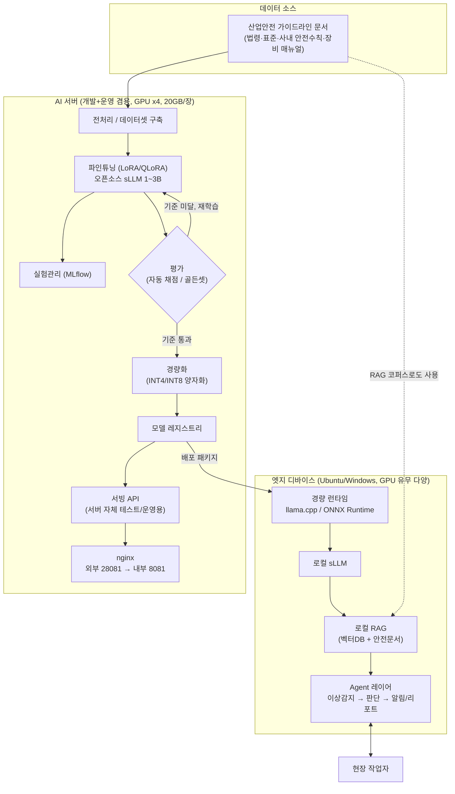

# MLOps-Edge-Lab 전략

## 1. 목표

1. **MLOps 파이프라인 구축** — 실험관리 → 학습 → 평가 → 배포 → 모니터링까지 이어지는 흐름을 직접 만들어본다
2. **엣지 디바이스용 sLLM 구축** — 경량화된 모델을 실제 엣지 하드웨어에서 돌려본다

개인 학습이 목적이며, 완료 후 교육 자료로 재구성할 계획이다. 그래서 **모든 진행 단계는 "왜 이렇게 했는지"를 함께 기록한다** — 결과물만으로는 나중에 왜 그 선택을 했는지 복원할 수 없기 때문이다(`CLAUDE.md` 작업 원칙).

## 2. 서비스 아이디어

사내 자동화(ARWS, BidRadar)를 확장하는 방향이 아니라, **그립의 실제 사업 분야(산업안전관리, 스마트교육)에 맞는 서비스**로 방향을 잡았다. 이렇게 한 이유는 두 가지다 — ① 실제 사업 도메인일수록 "이 기술이 왜 필요한가"가 명확해지고, ② 두 도메인 다 그립이 이미 다루는 영역이라 데이터·문제의식을 구하기 쉽다.

### 2.1 1차 MVP — 현장 안전 오프라인 어시스턴트

**왜 이 아이디어인가**: 산업 현장은 네트워크가 끊겨 있거나 보안상 외부 통신이 막힌 경우가 많다. 클라우드 LLM을 아예 못 쓰는 조건이 오히려 엣지 sLLM이 존재해야 하는 이유가 된다. 또한 관련 안전 가이드라인 문서(법령·표준·사내 안전수칙·장비 매뉴얼)를 다수 확보할 수 있어 RAG용 데이터 확보가 병목이 아니다.

세 단계로 나누어 확장한다 — 단계를 나눈 이유는 각 단계가 서로 다른 AI 기술(추론 → 검색 결합 → 도구 사용)을 대표해서, 하나씩 완성하며 그 기술을 이해하는 게 목적에 맞기 때문이다.

| 단계 | 내용 | 대표 기술 |
|---|---|---|
| ① sLLM | 이벤트/센서 로그를 자연어 알림으로 요약 (예: "센서34 임계값 초과" → "3동 2층 화기작업구역, 미착용 안전모 3건 감지") | 경량 모델 파인튜닝·양자화·온디바이스 추론 |
| ② +RAG | 안전수칙·법령·장비 매뉴얼을 로컬 검색해 질의응답 ("이 화학물질 다룰 때 보호구는?") | 임베딩, 벡터 검색, 근거 기반 응답 |
| ③ +Agent | 이상 감지 → 담당자 판단 → 알림 경로 결정(1차 알림, 미확인 시 에스컬레이션) → 사고 리포트 초안까지 자동 처리 | 툴 사용, 멀티스텝 추론 |

### 2.2 2차 트랙 — 스마트교육 (✅ 구축 완료, 2026-09-20)

원래 "1차 MVP 완료 후 재검토"로 보류해뒀으나, 사용자 지시로 1차 MVP와 병행해 실제로 구축했다. 세부 로드맵·현황은 6-1절 참고.

- **AI튜터** — 완전 오프라인 학습 튜터. RAG(중학교 사회과 경제·지리) + LoRA 파인튜닝(`edu-social-lora`) + 오답노트/학습 진도 추적(localStorage). 라이선스 제한 소스는 명시적 동의 시에만 학습에 포함하도록 별도 안전장치를 둠(의사결정_로그 91번).
- **"AI 토론"** — 원래 구상한 "AI 토론 배틀"을 실제로 구현. 주제 생성 → 학생 의견 에뮬레이션(임베딩+균형 k-means로 팀 배정, LLM은 라벨링만) → RAG 기반 토론 자료 → 재의견 수집 → 전후 변화를 SVG Sankey로 시각화(의사결정_로그 93번).

### 2.3 확장 검토 — 화장품 제조 AX PoC (🔶 concept 검증 완료, 2026-09-20)

MLOps-Edge-Lab 자체 서비스 로드맵이 아니라, 그립이 진행 중인 실제 고객 제안 2건(`docs/화장품/` — 충북 세화피앤씨, 강원 라이프투게더) 중 **강원 제안서의 AI Agent + sLLM 부분**을 검증하기 위해 이 저장소 안에 확장으로 추가했다(별도 프로젝트로 분리하지 않기로 한 사용자 결정, 의사결정_로그 107번). 세화피앤씨 제안은 XGBoost/SHAP 등 정형 ML뿐이라 sLLM과 무관해 대상에서 제외.

**범위**: 제안서의 4-Layer 아키텍처(Layer1 장비·Layer2 데이터·Layer3 AI분석·Layer4 AI에이전트) 중 **Layer 4만 완성도 있게 구현**하고 Layer 1~3은 mock — 산업안전 Agent(1차 MVP ③단계)에서 이미 검증한 "판정은 규칙, 서술·도구호출은 LLM, 근거 없으면 모른다, 고위험은 사람 승인" 원칙을 그대로 재사용. Layer 1~4가 실시간으로 이어지는 걸 보여주기 위해 발효 공정 DO(용존산소) 이상 시나리오를 무작위 데이터로 계속 생성하며, 운영자가 "악화"/"정상" 버튼으로 상황을 직접 조작하고 승인하면 그 결과가 장비 상태에 반영되는 것까지 시각화(`/cosmetics-poc`, 의사결정_로그 107~110번).

**개념 검증 결과**: 과거 배치 조회·신규 배치 추천·SOP 검색은 정확했고, 승인이 필요한 사안(설비 제어·품질 최종판정)에 대해 3회 테스트 모두 "임의 승인 안 함"이라는 핵심 안전 속성은 지켜졌다. 다만 매번 SOP 문서를 명시적으로 인용하며 거부하는지는 완전히 신뢰할 수 없어(4B급 소형 모델의 한계), 실 서비스 전 프롬프트 추가 튜닝 또는 더 큰 모델 검토가 필요한 지점으로 정직하게 남겨뒀다(의사결정_로그 107번).

**지금은 concept 검증 목적이라 프로덕션 견고함을 추구하지 않는다** — 실제 프로젝트가 착수되면 완전히 새로운 서버에 다시 구축할 예정(사용자 결정, 2026-09-20).

## 3. 시스템 구성도

**설계 원칙**: AI 서버 한 대가 개발과 운영을 겸하고(로컬 PC 미사용), 엣지 디바이스는 하드웨어가 균일하지 않다(Ubuntu/Windows, GPU 유무 불명)는 제약을 반영했다. 그래서 "GPU 서버에서 무겁게 학습 → 가볍게 패키징해서 엣지로 배포"하는 구조로 나눴다.

**다이어그램을 이렇게 읽으면 된다**:
- 왼쪽(데이터 소스) → AI 서버(학습 파이프라인) → 오른쪽(엣지 배포) 순서의 흐름
- AI 서버 내부의 `평가` 단계는 다이아몬드(분기)로 표시했다 — 기준 미달이면 재학습으로 돌아가는 루프가 MLOps의 핵심이기 때문
- 같은 모델 결과물(모델 레지스트리)이 두 갈래로 쓰인다: 서버 자체 서빙(운영/테스트용, nginx 통해 28081로 외부 노출)과 엣지 배포용 패키지 — 하나의 학습 파이프라인으로 두 목적을 다 커버하는 구조

## 4. 엣지 디바이스 제약과 설계 방향

- 엣지 디바이스는 Ubuntu 또는 Windows일 수 있고, **GPU가 없을 수도 있다** → 특정 GPU 백엔드(CUDA 전용)에 종속되지 않는 런타임을 기본값으로 삼는다 (예: llama.cpp, ONNX Runtime — CPU/GPU를 실행 시점에 자동 감지)
- 모델 크기는 CPU 추론이 실용적인 **1~3B급 + INT4 양자화**를 1차 목표로 한다 (7B급은 CPU에서 체감 속도가 느려짐)
- GPU가 있는 디바이스는 같은 런타임·같은 모델 파일이 자동으로 가속을 활용한다 — 디바이스 등급별로 모델을 따로 만들 필요가 없다

## 5. AI 서버 역할

- 개발과 운영을 겸한다(로컬 PC 미사용). 학습(LoRA/QLoRA 파인튜닝) · 실험관리(MLflow) · 모델 레지스트리 · 양자화 · 엣지용 패키징까지 전부 이 서버에서 수행한다
- 이 서버는 이 프로젝트 전용이 아니라 다른 프로젝트도 같이 쓰는 공식 서버라서, 각 도구의 기본 포트(5000/9090/3000)를 그대로 쓰지 않고 이 프로젝트 전용 대역(808x 내부 / 2808x 외부)을 새로 배정했다(의사결정_로그 68번)
- **포트 배정** — 웹 데모(8081→28081, 기존), MLflow(8082→28082), Prometheus(8083→28083), Grafana(8084→28084). nginx는 이 서버에 이미 떠 있지만 이 프로젝트와 무관한 우분투 기본 설정이라 안 씀 — 각 서비스를 직접 그 포트로 바인딩하고, 서버 관리자가 외부 포트포워딩만 추가해주는 방식
- **8081/28081이 실제 외부 연동 API로도 쓰이기 시작함**: 3번 그림의 `SERVE`(서빙 API)가 처음엔 "서버 자체 테스트/운영용"이라고만 적어뒀는데, 실제로 같은 포트·같은 FastAPI 앱에 BidRadar(사내 다른 프로젝트, ARWS·BidRadar와는 완전히 별개 인프라)가 호출하는 `/v1/*` 엔드포인트가 추가됐다(6-1절 5번, 의사결정_로그 94번) — 처음 그렸던 그림이 실제로 맞아떨어진 사례.

## 6. 로드맵

1. ✅ 서버 개발환경 골격 (Python 환경, MLflow, 프로젝트 구조) — 결정 근거는 `의사결정_로그.md` 1~6번
2. ✅ 산업안전 가이드라인 문서 수집 + 전처리 — 텍스트 추출 파이프라인 완료(738건 100% 성공: PDF/XLSX/OCR). HWP는 `pyhwp` 우선, LibreOffice 안전망, 확장자 오표기 재분기·TXT 지원까지 반영. 실제 HWP/DOC/XLS 샘플로는 아직 미검증(현재 데이터셋에 없음). 결정 근거는 `의사결정_로그.md` 7~12번
3. ✅ sLLM 파인튜닝 실험(오픈소스 소형 모델 + LoRA) + 자동 평가 — 배관(학습→MLflow→평가) 검증 완료, 베이스 모델 `Qwen3-4B-Instruct-2507`로 확정(`docs/모델_비교.md`). 학습 데이터는 합성 placeholder로 계속 진행하기로 확정(`의사결정_로그.md` 21번) — 정식 임계값 교체는 실서비스화 단계의 별도 과제. **재학습 자동화 완료**(`train/auto_retrain.py`, 의사결정_로그 38번) — 평가 기준 미달 시 에폭을 늘려 자동 재시도, 통과분만 정식 경로로 승격
4. ✅ 양자화 + CPU/GPU 겸용 런타임으로 패키징 — LoRA 병합→GGUF 변환→Q4_K_M 양자화(7.5GB→2.3GB) 완료. 같은 GGUF 파일로 CPU(8스레드 tg 23.6 t/s)·GPU(RTX4000 Ada tg 87 t/s, 약 3.7배) 둘 다 정식 벤치마크 완료 — "런타임 하나로 이기종 대응" 검증됨(`docs/양자화_비교.md`). 남은 것: `llama-cpp-python` 파이썬 통합(RAG/Agent 연결용), 양자화 전후 품질 비교(ROUGE-L). 결정 근거는 `의사결정_로그.md` 22~25번
5. ✅ RAG 레이어 추가 — 청킹(문단 슬라이딩윈도우)→임베딩(multilingual-e5-small)→FAISS→생성(sLLM) 배관 구축, 실제 안전문서 738건(12,964청크)으로 검증 성공(근거·출처 포함 답변 확인). 결정 근거는 `의사결정_로그.md` 26~27번
6. ✅ Agent 레이어 추가 (툴 사용, 에스컬레이션 로직) — 판정(초과·위험도)은 규칙, 검색 도구 호출 여부·검색어는 LLM, 알림·에스컬레이션·리포트 실행은 규칙이 트리거. 정상/주의/위험 3단계 시나리오 실제 검증 완료(사고리포트 초안까지 자동 생성). 3번에서 미해결로 남겼던 "LLM 과대판정" 문제를 여기서 해결. 장비 제어(환풍기·가스차단기·소화설비, 저위험 자동/고위험 승인대기)도 추가. **운영 피드백 루프 완료**(6→1/3번, 의사결정_로그 39번) — 시뮬레이션 페이지에서 피드백 제출 → `train/incorporate_feedback.py`로 학습 데이터에 반영. 결정 근거는 `의사결정_로그.md` 30·31·39번
7. 🔶 실제 엣지 디바이스(Ubuntu/Windows, GPU 유무 다양)에 배포·검증 — 실 하드웨어가 없어 서버에서 cgroup(`systemd-run`)으로 CPU 코어·메모리를 제한해 하한선 추정(2코어/32GB → tg 7.32 t/s). 메모리 상한이 모델보다 작을 때 스왑 때문에 "조용히 멈추는" 현상 발견, `MemorySwapMax=0`으로 해결. **주의**: 명령어셋(AVX-512 유무)·디스크 I/O·발열은 이 방법으로 재현 불가 — 진짜 하드웨어 확보 전까지는 하한선 추정일 뿐. 결정 근거는 `의사결정_로그.md` 32번
8. ✅ 교육 자료로 정리 — **형식: PPT(사내 `grib-ppt` 스킬 사용), `docs/교육자료/MLOps-Edge-Lab_교육자료.pptx`**. 이원 트랙 구성: Ⅰ 프로젝트 개요(전직원 공통), Ⅱ 개발자 레퍼런스 아키텍처(모델/양자화 선택 기준·성능 실측·설계 원칙·재현 가이드), Ⅲ 사업 활용 제안(시장 기회·경쟁 차별화·확장 영역·도입 로드맵). v2(`MLOps-Edge-Lab_교육자료_v2.pptx`)에서 Ⅱ 내부를 공통/산업안전 전용/AI튜터 전용 3그룹으로 재편(마스터 템플릿상 챕터가 Ⅰ/Ⅱ/Ⅲ 셋으로 고정돼 headerSub 접두어로 구분). 결정 근거는 `의사결정_로그.md` 28·50번

## 6-1. 로드맵 (스마트교육 트랙, ✅ 완료 — 2.2절 참고)

1차 MVP(산업안전) 로드맵과 별도로 병행 진행했다. 같은 서버·같은 sLLM(Qwen3-4B-Instruct-2507 Q4_K_M)을 쓰되 완전히 독립된 코퍼스·인덱스를 사용한다(도메인 섞임 방지 원칙).

1. ✅ AI튜터 RAG — 중학교 사회과(경제·지리) 문서를 `collect/registry.py`로 수집(공공데이터포털 등 10개 소스 등록, 실제 구현은 2개뿐 — 나머지 8개는 API 키 발급 대기 중인 로드맵 갭, 의사결정_로그 98번). BM25(형태소 내용어 필터)+임베딩을 RRF로 결합한 하이브리드 검색(의사결정_로그 90번).
2. ✅ AI튜터 파인튜닝 — `edu-social-lora`. 처음으로 베이스 모델 대비 개선폭을 정량 측정(ROUGE-L 0.239→0.373, 의사결정_로그 99번) — 다만 이 개선폭 중 "문체 모방"과 "내용 정확도"를 구분하지 못한다는 한계를 정직하게 기록.
3. ✅ AI 토론 — 2.2절 참고.
4. ✅ 품질 평가 파일럿 — 검색 회귀 테스트(`rag/build_golden_set.py`+`evaluate_retrieval.py`, LLM 초안+사람 검수로 골든셋 구성, hit_rate를 MLflow에 기록) + 파인튜닝 효과 비교(`train/compare_finetune.py`). 둘 다 지금은 표본이 작아(각 3문항, 12문항) 절대 수치보다 "회귀 테스트가 실제로 동작한다"는 파이프라인 자체에 의미가 있다(의사결정_로그 98·99번).
5. ✅ 외부 연동 — **BidRadar**(사내 다른 프로젝트, 완전히 별개 인프라)가 이 프로젝트의 sLLM 서빙 API(`/v1/*`, 5절에서 예약해둔 8081/28081 포트)를 실제로 호출해 쓴다. classify-doc/classify-topic/extract-requirements 3개 엔드포인트 구현·실측 검증 완료, extract-requirements는 레이턴시 문제로 GPU 서빙+비동기 job 폴링으로 전환(의사결정_로그 94~96번). 한때 있던 알려진 한계(cite 필드 토큰 오염, 청크 경계 중복 추출)는 각각 근거 숫자 검증·정규화 dedup으로 조치 완료(의사결정_로그 100·101번).

## 7. 웹사이트(교육용) — ✅ 1차 구현·배포 완료

원래는 로드맵 1~7번 완료 후 착수 예정이었으나 앞당겨 진행(`의사결정_로그.md` 33번). FastAPI(신규 의존성 아님) + Jinja2, tmux로 상시 실행, 외부 `http://thingx.grib-iot.com:28081/`에서 접속 확인 완료.

- **페이지 1(`/education`) — 교육 자료**: 로드맵 8번 PPT를 LibreOffice로 PDF 변환해 그대로 임베딩. pptx가 원본, PDF는 매번 재생성되는 파생물(`의사결정_로그.md` 51번)
- **페이지 2(`/`) — MLOps 파이프라인 시각화**: 단계별(데이터 추출→파인튜닝→양자화→RAG→Agent) 카드, 실측 수치는 하드코딩이 아니라 실제 파일을 읽어 매번 재계산
- **페이지 3(`/simulate`) — 시뮬레이션 페이지**: 센서 정보(공기질/가스/조리흄 수치)를 입력하면 `agent.run_agent()`가 그대로 실행되어, 판정·장비 조치·rule/llm 결정 추적·알림 문장·사고 리포트를 화면에서 확인 가능
- **페이지 4(`/control-room`) — 산업안전 통합관제**: 여러 현장을 백그라운드에서 자동으로 재계산해 보여주는 라이브 데모 + 4슬롯 수동 시뮬레이션 UI(원래 `/simulate`가 하던 역할을 흡수해 병합). 신뢰감 있는 남성 음성 TTS(`의사결정_로그.md` 56·93번)
- **페이지 5(`/edu-admin`) — AI 튜터**: RAG 기반 질의응답·퀴즈, Claude API 3종 비교, 오답노트/학습 진도 추적(localStorage), 친근한 여성 교사 음성+구어체 톤
- **페이지 6(`/ai-debate`) — AI 토론**: 2.2절 참고
- **페이지 7(`/bidradar`) — BidRadar 연동**: 시뮬레이션이 아니라 `/v1/*` 엔드포인트가 실제로 받은 BidRadar 호출 기록(엔드포인트별 통계·최근 호출 로그, 파일 기반이라 재시작해도 유지)을 실시간으로 보여줌. 일별 호출 추이 그래프 포함(의사결정_로그 106번)
- **페이지 8(`/cosmetics-poc`) — 화장품 AX PoC**: 2.3절 참고. Layer 1(장비)~4(AI Agent) 파이프라인이 무작위로 계속 흐르는 걸 시각화하고, 자유 질의도 가능(의사결정_로그 107~110번)
- **페이지 9(`/quality`)** — 품질 평가: 산업안전·AI튜터 두 도메인의 RAG 검색 회귀 테스트(hit_rate)와 파인튜닝 전후 비교를 서비스별로 보여줌(의사결정_로그 105번)

결정 근거는 `의사결정_로그.md` 33·34·51·56·93~110번.

## 8. 표준 MLOps 갭 — git 저장소 확보 후 구현

저장소: https://github.com/grib-arws-bot/mlops-edge-lab (의사결정_로그 45번). 서버(`~/mlops-edge-lab`) 자체가 이 저장소를 추적하며, 배포는 `scripts/deploy.sh`(git pull 기반, scp 대체)로 통일.

- ✅ **모델 레지스트리** — MLflow Model Registry 등록 + Production 승격(`train/auto_retrain.py`, 46번)
- ✅ **운영 모니터링** — Prometheus(`/metrics`)+Grafana(`infra/monitoring/`, 47번). 처음엔 SSH 터널 전용이었으나, 학습 프로젝트라 보안 부담이 낮다는 판단하에 외부 공개로 전환(68번, 8083/8084→28083/28084)
- ✅ **데이터 버저닝** — DVC, 로컬 원격(`~/dvc-storage`), `data/raw`+`data/processed` 추적(48번)
- ✅ **CI/CD** — 테스트(`tests/test_rules.py`)는 GitHub Actions 호스팅 러너, 배포는 AI 서버에 등록한 자체 호스팅 러너(라벨 `mlops-edge-lab`)가 담당. push마다 테스트→배포가 완전 자동으로 돎(실측: 27초). 등록 절차는 사용자가 직접 수행(49·55번)
